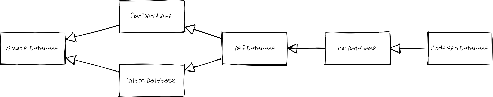

# Salsa

The Mun backend makes extensive use of [Salsa](https://github.com/salsa-rs/salsa) to perform on-demand, incremental computations. `salsa` lets you define your program as a set of _queries_.
Every query is used like a function `K -> V` that maps from some key `K` to a value of `V`.
Changing the input `K` also invalidates the result of computing `K -> V`.
However, if the result `V` does not change after changing `K` the invalidation is not propagated to computations that use `V` as an input.
This enables Mun to cache a lot of computations between compilations, enabling very fast rebuilding on incremental changes.

> For more in depth information on Salsa please refer to the [Salsa repository](https://github.com/salsa-rs/salsa) or the [Salsa book](https://salsa-rs.github.io/salsa/).

## Databases

Queries are grouped together in so-called _databases_ defined as traits.
Database traits can have super traits that enable them to build upon other queries.

Figure 4-1: Super trait relations between Salsa databases

> This design is heavily inspired by [Rust Analyzer](https://github.com/rust-analyzer/rust-analyzer).

### `SourceDatabase`

The `SourceDatabase` provides queries and inputs that form the basis of all compilation because it contains the original source text.

The `SourceDatabase` holds `SourceRoot`s which are groupings of files.
`SourceRoot`s define the hierarchy of files relative to a certain root.
For the system it's not interesting where the files come from and how they are actually organized on disk.
`SourceRoot`s provide an abstraction over the filesystem that provides just enough information for the backend to function.

Another relevant query is the `line_index` query which provides line and column information for characters in a source file.
This is used for instance when emitting human-readable diagnostic messages with line and column numbers.

### `AstDatabase`

The `AstDatabase` provides syntax tree transformations on top of the source text.
The `parse` function returns the [Concrete Syntax Tree](https://en.wikipedia.org/wiki/Parse_tree) (CST) of a file provided by the `mun_syntax` crate.
Any errors related to parsing are stored in the tree itself.

As an example of where Salsa helps Mun achieve faster incremental compilation: changing a single character in a file will also change the CST which in turn will invalidate a lot of computations.
However, most changes occur within blocks (like functions or structs).
To not invalidate everything in the changed file, another query transforms the CST to an `AstIdMap` which assigns ids to all top-level items in a file.
This enables referring to those ids in later stages of compilation which will change much less often.

### `InternDatabase`

The `InternDatase` links certain locations in the syntax tree to ids.
For instance, it associates a function syntax node with a `FunctionId`.
This id is then used everywhere in code to refer to the specific function instance.
The same happens for other items like structs.
The purpose of this _interning_ is again to allow better incremental compilation for queries that only need to refer to certain constructs without having to refer to the volatile syntax tree elements.

### `DefDatabase`

The `DefDatabase` provides definitions extracted from the syntax trees.
It provides desugared or lowered versions of language constructs that enable other queries to query specific information for these constructs.
Extracting this data again enables faster incremental compilation because if the extracted data does not change dependent queries also will not change.

### `HirDatabase`

The `HirDatabase` resolves all types and names from the definitions.
It also performs type inferencing.
The resulting High-Level Representation (HIR) is the input for the LLVM Intermediate Representation (LLVM IR).
The HIR data structures can also contain errors, but only if there are no errors present will generating IR be valid.

### `CodeGenDatabase`

Finally, the `CodeGenDatabase` provides queries to construct assemblies from groups of files.
Assemblies are the final product of the Mun compiler.
They are the binaries that can be executed by the runtime.
This stage is where Salsa really shines; only if something actually changed in the HIR will an assembly be created.

## Language Server

The language server uses the same backend as the compiler.
Whereas the compiler creates assemblies the language server queries the different databases to provide a user with code intelligence.
It also uses the exact same diagnostics paths as the compiler, which means there is never a mismatch between the compiler and the language server - and vice versa.
If compiling your code results in an error it will also be immediately visible in your IDE.
